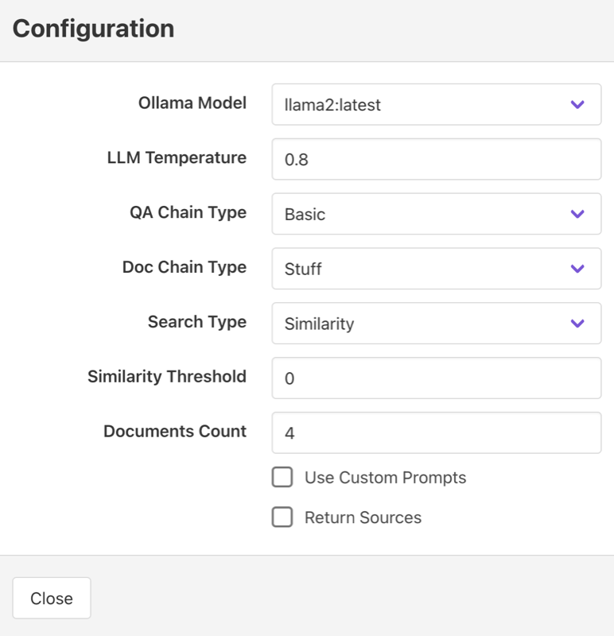
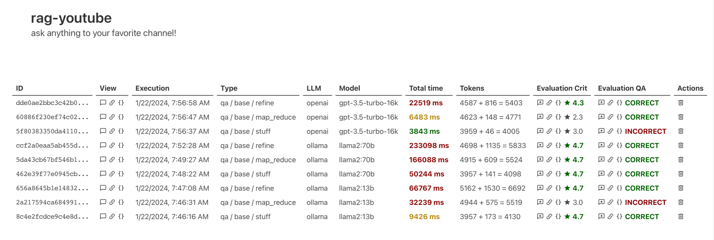

# rag-youtube

A set of scripts to build a RAG from the videos of a YouTube channel.

This has evolved in being a playground to explore RAG applications. Notably:
- Retrieval and generation parameters can be changed for each question
- Processing information is added to response payload and can be visualized
- A number of files are dumped during processing with even more information (json format)

## Screenshots

<span>

&nbsp;&nbsp;&nbsp;&nbsp;

&nbsp;&nbsp;&nbsp;&nbsp;

</span>

## Prerequisites

YouTube Data API: You need a Google Cloud account and a project set up in the Google Developer Console. Enable the YouTube Data API for your project and get an API key.

Get the video ID of any of the videos of the channel you want to analyze. You can extract this directly from the URL. For instance in `https://www.youtube.com/watch?v=AS2m2rRn9Cw&t=211s` the video ID is `AS2m2rRn9Cw`.

The following LLMs are supported:
- [Ollama](https://ollama.ai) (default)
- [OpenAI](https://openai.com)

The following embeddings models are supported:
- [HuggingFace Sentence Transformers models](https://www.sbert.net/docs/pretrained_models.html) (default)
- OpenAI
- [Nomic](https://www.nomic.ai)
- Ollama

## Setup

### Dependencies

```
pip install -r requirements.txt
```

### Ollama

You need to install Ollama and download at least one model. Mistral or LLama2 are preferred:

```
ollama pull mistral:latest
ollama pull llama2:latest
```

### OpenAI

If you want to use OpenAI by default, please refer to the Configuration section below and set `llm=openai` in the General section of your configuration file. If you also want to disable Ollama set `ollama_url=disabled`.

In any case, to use OpenAI, you need to specify:
- `openai_org_id`: your OpenAI Organization ID
- `openai_api_key`: your OpenAI API key
- `openai_model`: the [OpenAI model](https://platform.openai.com/docs/models) you want to use (defaults to `gpt-3.5-turbo-1106`).

### LangSmith

You can enable LangSmith integration through configuration (see section below). You need to specify:
- `langchain_api_key`: your LangChain/LangSmith API key
- `langchain_project`: the LangSmith project (optional, defaults to `default`)

## Preparation

We will execute the following steps:

- Get the list of all videos of the channel
- Download subtitles/captions for each video
- Load the subtitles/captions in our vector database

Once this is done, you can run the web interface and ask questions to the channel host!

### List all videos

```
GOOGLE_API_KEY=XXXX ./src/list_videos.py AS2m2rRn9Cw
```

Of course, replace `XXXX` and `AS2m2rRn9Cw` with your own values. This will create a file called `videos.json` with all the information.

### Download the subtitles/captions

```
./src/download_captions.py
```

This will create a folder `captions` and download two files for each video:
- `<id>.original.vtt`: original subtitles/captions
- `<id>.cleaned.vtt`: processed subtitles/captions (timestamps removed)

Note that if the original captions already exist, they will not be downloaded again. Existing files will be processed again to recalculate cleaned versions (useful in case of rag-youtube upgrade).

### Load in the database

```
./src/document_loader.py
```

This will load all documents and create a file called `loaded.json` with the files correctly processed. This way, you can re-run the script if you downloaded new subtitles and just add the new ones to the database.

To start over, simply delete the `db` folder and run the script.

## Asking questions

```
./src/app.py
```

Then access [http://localhost:5555](http://localhost:5555).

## Configuration

You can change some defaults by creating a `rag-youtube.conf` file in the base folder. A good way to start is to copy `rag-youtube.sample.conf`: it contains all optios commented out with default values specified. Feel free to play with them!

For the embeddings model, default is to use a [HuggingFace Sentence Transformers models](https://www.sbert.net/docs/pretrained_models.html). Just specify the name of the model in the configuration file (key is `model` in `Embeddings` section).

You can specify `ollama` to use Ollama embeddings. This will use the embeddings of the default Ollama model (as specified in the configuration).

You can also use [OpenAI Embeddings](https://platform.openai.com/docs/guides/embeddings/what-are-embeddings).  Specify `openai:xxx` where `xxx` is the model name. Don't forget to setup your OpenAI API key in the Configuration file for this.

You can also use [Nomic](https://www.nomic.ai) embeddings. Specify `nomic:xxx` where `xxx` is the model name. If you do not specify a model name (`nomic:`), it defaults to [`nomic-embed-text-v1`](https://blog.nomic.ai/posts/nomic-embed-text-v1). Make sure your nomic account is setup correctly by typing `nomic login` on the command line and following the instructions. 

For enumerated options, acceptables values are:
- `llm`: `ollama`, `openai`
- `chain_type`: `base`, `sources`, `conversation`
- `doc_chain_type`: `stuff`, `map_reduce`, `refine`, `map_rerank`
- `retriever_type`: `base`, `multi_query`, `compressor`
- `search_type`: `similarity`, `similarity_score_threshold`, `mmr`
- `memory_type`: `buffer`, `buffer_window`, `summary`

## Prompt Engineering

You have the options to use custom prompts. Those are located in the `prompts` folder. You can edit them without restarting the app.

## Debugging

You can enable langchain debugging through configuration. In that case, it is recommended to redirect the output to a text file and replace the following regex `[ \t]*"context": \[[\d, \t\n]*\],\n` with nothing to clear up the trace.

## Benchmarking

If you want to benchmark several LLM in combination with chain types and other parameters, you can tweak the `test/compare.py` script. This will allow you to batch execute multiple combinations and then use the monitoring dashboard (see below) to compare results. Be cautions of costs if your benchmark includes OpenAI!

## Monitoring

This is a WIP prototype. To enable it, you need to create the database:

```
make createdb
```

Then access [http://localhost:5555/dashboard.html](http://localhost:5555/dashboard.html).
